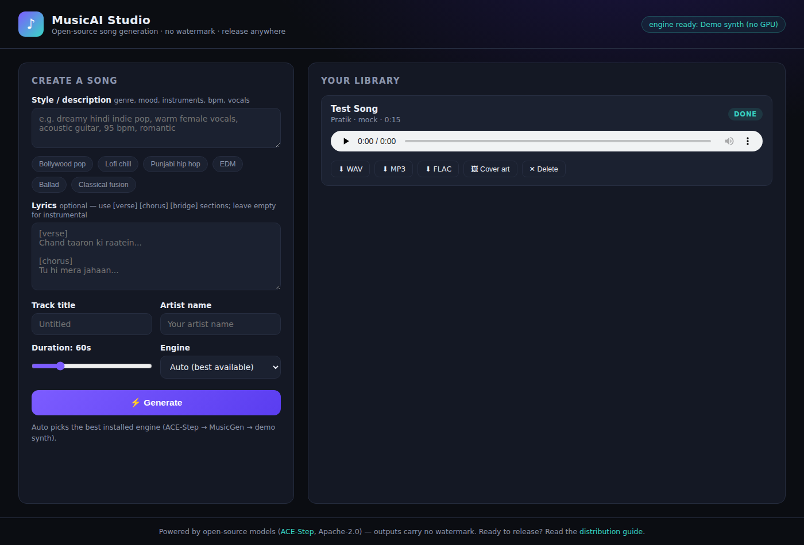

# 🎵 MusicAI Studio

**Open-source AI music generation studio** — generate complete songs with
vocals and lyrics, download watermark-free masters, and release them on
Spotify, Apple Music, YouTube Music and every other platform.

Built on open models, self-hosted, with **no watermark**, **no credits
system**, and **no platform claiming rights over your music** — the things a
closed service like Suno can't give you.



## Features

- 🎤 **Full songs with vocals + lyrics** via [ACE-Step](https://github.com/ace-step/ACE-Step)
  — the leading open-source song model (Apache-2.0 code *and* weights)
- 🎹 **Instrumental generation** via Meta's MusicGen (drafts/personal use)
- 🧪 **Demo synth engine** — try the entire app with zero GPU and zero downloads
- 📀 **Distribution-ready exports**: 44.1 kHz/16-bit WAV master, 320 kbps MP3,
  FLAC — with title/artist/album/genre and cover art embedded
- 🖼️ Cover-art upload per track
- 📚 Track library with playback, retry, delete
- 🚀 Single-command run; optional Docker with GPU support

## Try it live on a free GPU

[](https://colab.research.google.com/github/ppratik2026/Musicai/blob/claude/music-ai-app-open-source-kl30zq/colab/MusicAI_Colab.ipynb)

One click → free Google Colab GPU → public URL with the full app running
real ACE-Step generation. See [docs/LIVE_TESTING.md](docs/LIVE_TESTING.md)
for all the ways to test (laptop demo, Colab, rented GPU).

## Quick start (no GPU needed)

```bash
git clone https://github.com/ppratik2026/Musicai.git
cd Musicai
pip install -r requirements.txt
uvicorn app.main:app --host 0.0.0.0 --port 8000
```

Open **http://localhost:8000** — the demo synth engine works out of the box so
you can explore the full workflow immediately.

## Real AI generation (GPU)

On a machine with an NVIDIA GPU (8 GB+ VRAM):

```bash
pip install -r requirements.txt -r requirements-models.txt
uvicorn app.main:app --host 0.0.0.0 --port 8000
```

ACE-Step checkpoints download automatically on the first generation
(to `checkpoints/ace_step/`). No GPU at home? Rent one for ~$0.20–0.50/hour
(RunPod, Vast.ai, Lightning AI) or run on Google Colab.

### Docker

```bash
docker compose up --build
```

Uncomment the `deploy:` block in `docker-compose.yml` to pass your NVIDIA GPU
through. Set `MODELS: "0"` for a lightweight demo-only image.

## Using the studio

1. **Describe the style** — genre, mood, instruments, BPM, vocal type:
   `dreamy hindi indie pop, warm female vocals, acoustic guitar, 95 bpm`
2. **Write lyrics** (optional) with `[verse]` / `[chorus]` / `[bridge]`
   sections — leave empty for an instrumental.
3. Pick a **duration** and **engine**, hit **⚡ Generate**.
4. Play the result, upload **cover art**, and download **WAV/MP3/FLAC**.

## Engines & licensing (read this before releasing!)

| Engine | Output | License | Commercial release |
|---|---|---|---|
| **ACE-Step** | Full songs, vocals + lyrics | Apache-2.0 (code + weights) | ✅ Yes — no watermark |
| **MusicGen** | Instrumental | MIT code, **CC-BY-NC** weights | ❌ Drafts only |
| **Demo synth** | Procedural placeholder | MIT (this repo) | ✅ Yes |

For anything you plan to distribute or sell, generate with **ACE-Step**.

## Releasing to Spotify / Apple Music / everywhere

See **[docs/DISTRIBUTION.md](docs/DISTRIBUTION.md)** — a complete guide:
distributor comparison (DistroKid, TuneCore, Amuse, RouteNote, LANDR, CD Baby),
upload checklist, cover-art specs, and AI-content policy notes.

## API

The frontend is a thin client over a JSON API you can automate:

| Endpoint | Method | Purpose |
|---|---|---|
| `/api/engines` | GET | List engines + availability |
| `/api/generate` | POST | Queue a generation job |
| `/api/tracks` | GET | Library |
| `/api/tracks/{id}` | GET/PATCH/DELETE | Track detail / metadata / delete |
| `/api/tracks/{id}/retry` | POST | Re-run a failed job |
| `/api/tracks/{id}/cover` | POST | Upload cover art |
| `/api/tracks/{id}/audio` | GET | Stream WAV |
| `/api/tracks/{id}/download?fmt=wav\|mp3\|flac` | GET | Tagged download |

Interactive docs at `/docs` (Swagger UI).

## Configuration

| Env var | Default | Meaning |
|---|---|---|
| `MUSICAI_ENGINE` | `auto` | `ace_step`, `musicgen`, `mock`, or `auto` |
| `MUSICAI_DATA_DIR` | `./data` | Audio, covers and database location |
| `MUSICAI_ACE_CHECKPOINT_DIR` | `./checkpoints/ace_step` | ACE-Step weights |
| `MUSICAI_ACE_DTYPE` | `bfloat16` | Set `float16` on pre-Ampere GPUs (e.g. Colab T4) |
| `MUSICAI_ACE_CPU_OFFLOAD` | `0` | `1` = fit ACE-Step on low-VRAM GPUs (slower) |
| `MUSICAI_ACE_QUANTIZED` | `0` | `1` = quantized ACE-Step weights (needs torchao) |
| `MUSICAI_ACE_OVERLAPPED_DECODE` | `1` | Chunked decoding for long songs (keep on) |
| `MUSICAI_MUSICGEN_MODEL` | `facebook/musicgen-small` | Any MusicGen HF model |
| `MUSICAI_MAX_DURATION` | `240` | Max track length (seconds) |

## License

MIT — see [LICENSE](LICENSE). Model licenses are listed above and govern the
audio they produce.
